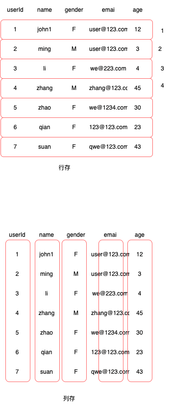

# OLAP的数据存储格式整理（一）

## 行存和列存基本概念

传统的数据库表数据在物理存储上是一维的，通常以二进制形式存储在硬盘上。这种物理存储方式可能不直观，但通过适当的数据结构和算法，数据库管理系统可以有效地将这些一维数据映射为我们所熟悉的二维表格。

现代数据库系统在处理表格数据时，确实采用了不同的存储方式，这主要是为了在不同的应用场景下提供更好的性能和效率。

列存储（Column-Store）：在列存储中，表中的每一列被单独存储，相比行存储更适合处理分析型操作（OLAP，Online Analytical Processing）。
分析型操作通常涉及对大量数据进行聚合、过滤、分组等计算，列存储可以减少不必要的数据读取，从而提高查询性能。
列存储适合数据仓库和报表等场景，其中数据的写入相对较少，而查询操作较为频繁。

行存储（Row-Store）：在行存储中，整个行的数据被连续存储在磁盘上，适用于事务型操作（OLTP，Online Transaction Processing）。
事务型操作通常涉及大量的数据插入、更新和删除，行存储可以更有效地处理这些操作。
行存储适用于需要频繁修改数据的应用，如在线交易系统，其中读写操作都很常见。

>- 行存：按照将整行的tuple顺序的存放在硬盘中；依次放入每行数据 （Store one row sequentially, followed by the next row, and then the next one）

>- 列存：按照将列的顺序的存放在硬盘中；依次放入每列数据 （store the first column sequentially, followed by the next column, and then the next one, etc.）

#### 数据读取
- 情况一：如果用户每次请求都是一个tuple，或者对象的，那么行存的优势就非常明显；比如：想要查看user(id,name,email) id =3的用户信息，那么通过行存，它的索引，就会直接快速定位到；适合场景是业务系统，登陆页面，查看用户信息等或者订单详情这种场景；
- 情况二：如果是大规模的查询，特别是大数据下的留存，只需要查询一部分列，或者统计用户行为特征等情况下的查询，列存只需要扫描特定的列情况，数据所需的内存会更少，而行存需要扫描所有的列，则所需要更大的内存

#### 存储对比
- 两者都存储的数据信息肯定都是差不多的，但是列存更适合做一些压缩算法，比如上面的性别，如果用列存加上字典编码，可以更好的利用压缩算法，消耗更少内存；
- 但是行存，由于内存对其，每个tuple类型不一样，同时存储器为了加快数据存取，还存在数据对齐问题，这样的话，列存在压缩方面更有优势

#### 数据写入
- 行存储的写入是一次完成。列存储由于需要把一行记录拆分成单列保存，写入次数明显比行存储多，再加上磁头需要在盘片上移动和定位花费的时间，实际时间消耗会更大。所以，行存储在写入上占有很大的优势还有数据修改,这实际也是一次写入过程。所以，数据修改也是以行存储占优。
- 但是现在有对于不同场景，列存很多场景下使用append only 这种场景，后台进行compact，这样写入的话，会弥补列存在这方面的劣势

## 参考文献

1:[Apache Arrow vs. Parquet and ORC: Do we really need a third Apache project for columnar data representation?](http://dbmsmusings.blogspot.com/2017/10/apache-arrow-vs-parquet-and-orc-do-we.html)

2:[表存储格式：列存、行存、行列共存](https://help.aliyun.com/zh/hologres/user-guide/storage-models-of-tables)

3:[聊一聊数据库的行存与列存](https://www.modb.pro/db/417485#)

