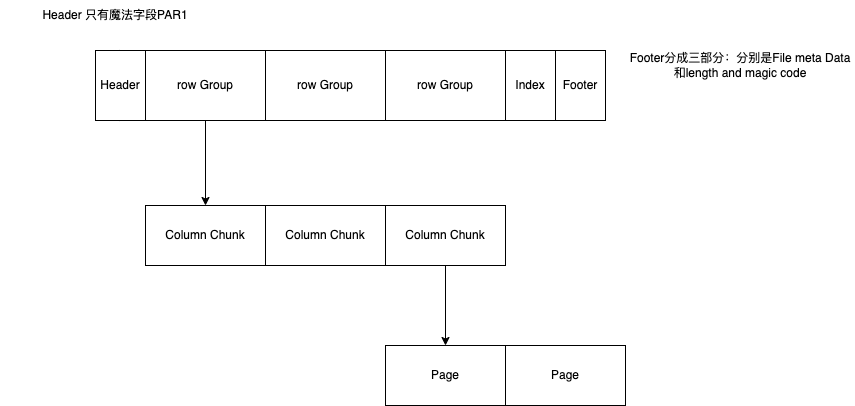

##  postgres 数据存储格式
postgres 是OLTP 事务性数据库的代表之一，最近几年有超过mysql的姿态；他的数据存储页分成四个部分
- PageHeaderData: 24字节长整型。包含关于页的一般信息，包括空闲空间指针。
- ItemIdData: 指向实际项的（偏移量，长度）数组对。每项4字节。(索引)
- Free space：未分配空间。从这个区域开始分配新项指针，从结尾开始分配新项。
- Items：实际项本身（存储row信息）
- Special space：索引访问方法专用数据。不同方法存储不同的数据。对于普通表该区域为空。

## OLAP  doris数据存储格式

>- 文件包括：
- 文件开始是8个字节的magic code，用于识别文件格式和版本
- Data Region：用于存储各个列的数据信息，这里的数据是按需分page加载的
- Index Region: doris中将各个列的index数据统一存储在Index Region，这里的数据会按照列粒度进行加载，所以跟列的数据信息分开存储
>- Footer信息
- FileFooterPB:定义文件的元数据信息
- 4个字节的footer pb内容的checksum
- 4个字节的FileFooterPB消息长度，用于读取FileFooterPB
- 8个字节的MAGIC CODE，之所以在末位存储，是方便不同的场景进行文件类型的识别
- 文件中的数据按照page的方式进行组织，page是编码和压缩的基本单位。现在的page类型包括nullable和non-nullable的data page;本质上前者多了 bitmap length 和nullBitmap的信息，分别表示bitmap的字节数和null信息的bitmap

#### 基本概念

数据存储块：这个是hdfs中不可更改的数据格式，HDFS中数据最小单元；

文件：一个HDFS文件必须包括文件的元数据，它可以不存放数据
行组：数据逻辑的水平分区单元；它不是数据的实际物理单元；一个行组是多个列存数据的集合；
列存块：每个列存储的最小单元，他存储在特定的row group当中；并保证在文件中是连续的
Page:column chunk被切分成多个pages, 一个Page是理论上不可分割的最小单元（在编码和压缩方面）;一个column chunk 被不同的page交叉组合而成
总体来说，一个文件包括一个1个和多个的文件行组，一个文件行组包含一个或多个column chunk; 一个column 包含一个或着多个pages;

补充说明，[parquet-922]说明了在partquet格式中增加columnIndex和offsetIndex加快了数据扫描的速度，索引结构加上Footer的前面，和RowGroup分割开来；

- 在列式存储里面，对于json文件格式和null的数据都是需要特殊处理的格式，parquet 主要是通过线repetition 和definition  level来定位其级别；

## 参考文献
1:[How Postgres Stores Rows](https://ketansingh.me/posts/how-postgres-stores-rows/)
2:[59.6. 数据库页布局](http://www.postgres.cn/docs/9.4/storage-page-layout.html)
3:[Doris存储文件格式优化](https://doris.apache.org/zh-CN/community/design/doris_storage_optimization/)
4:[demystifying the parquet file format](https://towardsdatascience.com/demystifying-the-parquet-file-format-13adb0206705)
5:
6:
7:[parquet-922: sortColumnIndex Layout to support page skipping](https://docs.google.com/document/d/1sBACp8Lbutuj1Zxdowvsrlm8ku4BFxf8U_Do5K2wSO4/edit)
8:[The striping and assembly algorithm from the Dremel paper](https://github.com/julienledem/redelm/wiki/The-striping-and-assembly-algorithms-from-the-Dremel-paper)